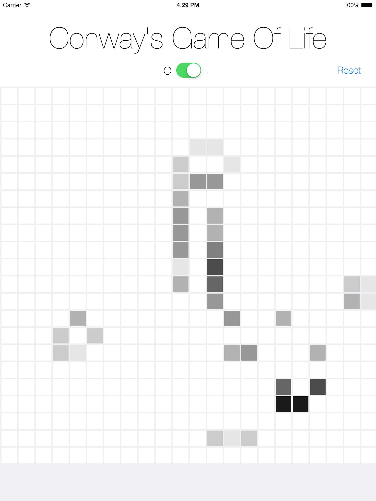
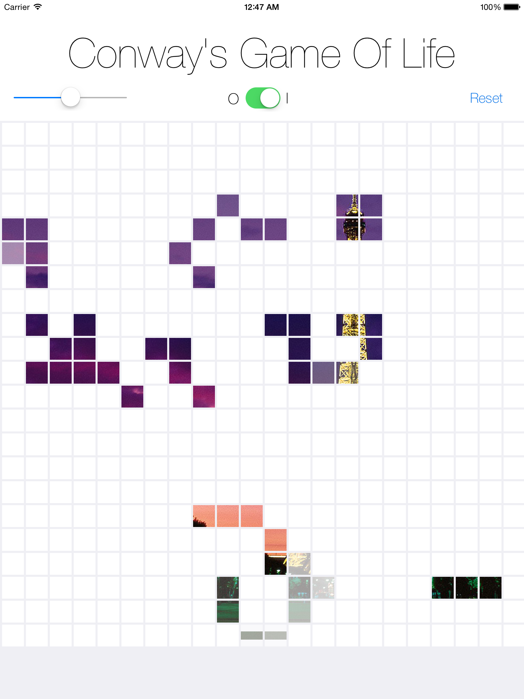

Conway's Game Of Life
----------------------

An iPad app that follows the rules of Conway's Game of Life game.

The game is played after an initial entry of "live" cells, and those cells live by the rules set by Conway's Game Of Life. An added bonus in this demo is a differentiation of how often a cell comes back to life by a darker shade.

Second Iteration:
-----------------

Using different ideas on how to make the game more dynamic for the players... Guess the image? See the screen shot below. Images are randomly chosen, and you have to figure out what city it is, but how you setup the initial population.

